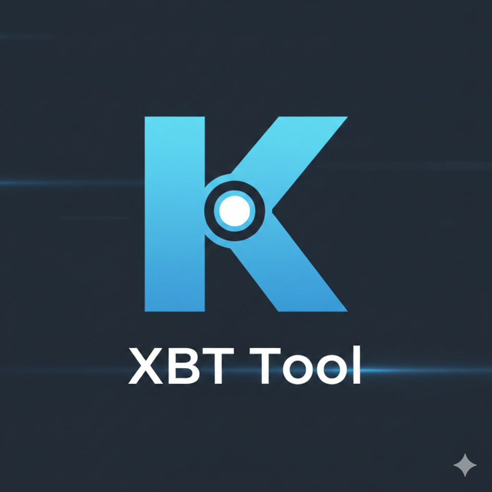

[Deutsch](README.de.md) | **English**

<div align="center">
  
</div>

# kodixbttool

**Kodi-conform** extract and pack tool for Kodi XBT texture archives (`.xbt`). Use it to unpack skin textures (e.g. `Textures.xbt`, `Square.xbt`), edit them, and pack them back into a single `.xbt` file that Kodi loads correctly.

## What it does

- **Extract** – Unpack a `.xbt` file to PNG/JPEG (and optionally GIF where supported) and recreate the directory tree.
- **List** – Print all file paths inside a `.xbt` without extracting.
- **Pack** – Build a `.xbt` from a directory of PNG/JPEG images (Kodi 17+ / Omega 21: A8R8G8B8/RGB8, **LZO-compressed**). **By default** the source directory is removed after a successful pack so it is not shipped with your skin or add-on; use `--no-remove-input` to keep it.
- **Unused textures** – List or remove textures that are not referenced in the skin's XML files (cross-platform). When packing, you can be prompted to remove unused textures before packing, or use `--remove-unused` / `--no-remove-unused`.

Output format matches the [Kodi TexturePacker](https://kodi.wiki/view/TexturePacker) specification so that packed files work in current Kodi versions.

## Requirements

You need these libraries to build and run kodixbttool:

- **liblzo2**
- **libpng**
- **libjpeg** (libjpeg-turbo recommended for alpha)
- **libgif**
- **libsquish**

### Linux

Install development packages, for example:

- **Debian / Ubuntu:**  
  `sudo apt install liblzo2-dev libpng-dev libjpeg-dev libgif-dev libsquish-dev`
- **Arch:**  
  `sudo pacman -S lzo libpng libjpeg-turbo giflib libsquish`
- **Fedora:**  
  `sudo dnf install lzo-devel libpng-devel libjpeg-turbo-devel giflib-devel libsquish-devel`

### macOS

With [Homebrew](https://brew.sh):

```bash
brew install lzo libpng libjpeg-turbo giflib libsquish
```

### Windows

Install [vcpkg](https://vcpkg.io/), then install dependencies and build with CMake (use the vcpkg toolchain so CMake finds the libraries):

```powershell
vcpkg install libpng libjpeg-turbo lzo giflib libsquish
mkdir build
cd build
cmake .. -DCMAKE_BUILD_TYPE=Release -DCMAKE_TOOLCHAIN_FILE="[path-to-vcpkg]/scripts/buildsystems/vcpkg.cmake"
cmake --build . --config Release
```

The binary is `build\Release\kodixbttool.exe`. Alternatively use the [pre-built binary](https://github.com/benjarogit/kodixbttool/releases) (`kodixbttool-windows-x64.exe`) or [WSL2](https://docs.microsoft.com/en-us/windows/wsl/) and follow the Linux instructions.

### WSL2

Same as Linux; install the packages for your WSL distribution (e.g. Ubuntu) as above.

## Downloads

Pre-built binaries (Linux, macOS, Windows) and source archives are published in the [Releases](https://github.com/benjarogit/kodixbttool/releases) section. One binary is used for both **extracting** and **packing**; download the build for your platform or build from source (see below).

**How paths work:** The tool does **not** ask you for paths when you start it. There is **no config file**. You always pass paths on the command line: input file or folder, output file or folder. Your .xbt files can be anywhere; you can use full paths or relative paths. Examples: `./Textures.xbt`, `C:\Kodi\addons\skin.my\media\Textures.xbt`, or `~/Library/Application Support/Kodi/addons/skin.my/media/Textures.xbt`.

**Typical Kodi skin media folder (where Textures.xbt and Square.xbt usually live):**

| Platform | Typical path |
|----------|--------------|
| Linux    | `~/.kodi/addons/skin.NAME/media/` |
| macOS    | `~/Library/Application Support/Kodi/addons/skin.NAME/media/` |
| Windows  | `%APPDATA%\Kodi\addons\skin.NAME\media\` (e.g. `C:\Users\You\AppData\Roaming\Kodi\addons\...`) |

Replace `skin.NAME` with your skin's addon folder (e.g. `skin.dokukanal`). Open a terminal (or Command Prompt / PowerShell on Windows), then run the commands below and use **your** path instead of the example path.

## Installation from source

```bash
git clone https://github.com/benjarogit/kodixbttool.git
cd kodixbttool
make
```

The binary is `kodixbttool`. Optionally copy it to a directory in your `PATH`, e.g.:

```bash
cp kodixbttool ~/.local/bin/
```

If you have CMake:

```bash
mkdir build && cd build
cmake .. -DCMAKE_BUILD_TYPE=Release
cmake --build .
```

Then run `./kodixbttool --help`.

**Note:** With giflib 5.x, GIF extraction is not supported (GIF entries are skipped with a message). Most skin textures are PNG/JPEG.

**Running tests:** The test script (e.g. `./test.sh`) expects at least one .xbt file. Set `KODIXBT_TEST_XBT_DIR` to a directory containing .xbt files (e.g. your skin media folder), or place .xbt files in a `testdata/` directory next to the script; if unset, the script may use a default path (e.g. a Kodi skin media directory).

## Usage

**Quick start (example for Linux with skin in `~/.kodi/addons/skin.dokukanal/media/`):**

```bash
# 1) Go to the skin media folder (or use full paths in the commands below)
cd ~/.kodi/addons/skin.dokukanal/media

# 2) Extract both archives (creates Textures_extracted and Square_extracted)
./kodixbttool -o ./Textures_extracted -c ./Textures.xbt
./kodixbttool -o ./Square_extracted -c ./Square.xbt

# 3) Optional: list textures that are not used in the skin
./kodixbttool --list-unused -i ./Textures_extracted

# 4) Pack again (e.g. after editing). You will be asked whether to remove unused textures.
./kodixbttool --pack -i ./Textures_extracted -o ./Textures.xbt
./kodixbttool --pack -i ./Square_extracted -o ./Square.xbt
```

If you downloaded the binary, use its path, e.g. `~/Downloads/kodixbttool` instead of `./kodixbttool`, or put it in your PATH and call `kodixbttool` from anywhere.

### Extract

Extract all files and create the directory tree (use **your** paths):

```bash
kodixbttool -o ./media/Textures_extracted -c media/Textures.xbt
```

List paths only:

```bash
kodixbttool -p media/Textures.xbt
```

Extract a single file:

```bash
kodixbttool -o ./out -c -f path/inside/file.png media/Textures.xbt
```

### Pack

Pack a directory of images into a `.xbt`:

```bash
kodixbttool --pack -i ./media/Textures_extracted -o ./media/Textures.xbt
```

Use `--dupecheck` to store identical image data only once (smaller file):

```bash
kodixbttool --pack -i ./media/Textures_extracted -o ./media/Textures.xbt --dupecheck
```

After a successful pack, the input directory is **removed by default** so it is not shipped with your skin/add-on. Use `--no-remove-input` if you want to keep it.

**Typical workflow:** Extract → edit images → pack (input dir is deleted automatically):

```bash
kodixbttool -o ./media/Textures_extracted -c media/Textures.xbt
# ... edit files in media/Textures_extracted ...
kodixbttool --pack -i ./media/Textures_extracted -o ./media/Textures.xbt
```

### Unused texture detection (cross-platform)

List textures in an extracted directory that are **not** referenced in the skin's XML files (useful to slim down the archive). The skin root is taken from `KODI_ADDONS` or `$HOME/.kodi/addons/skin.dokukanal` (Windows: `%USERPROFILE%\.kodi\addons\skin.dokukanal`), or set explicitly with `--skin-dir`:

```bash
kodixbttool --list-unused -i ./media/Textures_extracted
kodixbttool --list-unused -i ./media/Textures_extracted --skin-dir=/path/to/skin.dokukanal
```

When **packing**, if a skin directory is found (default or `--skin-dir`), the tool can remove unused textures before packing:

- **Interactive:** If stdin is a TTY, you are asked: *"N unused texture(s). Remove before pack? (y/N)"*. Answer `y` to remove them, then pack.
- **Non-interactive:** Use `--remove-unused` to remove unused textures without prompting, or `--no-remove-unused` to never remove them (e.g. in scripts or CI).

Paths starting with `default` (Kodi fallback icons) are never listed as unused and are not removed.

```bash
kodixbttool --pack -i ./media/Textures_extracted -o ./media/Textures.xbt --remove-unused
kodixbttool --pack -i ./media/Textures_extracted -o ./media/Textures.xbt --no-remove-unused
```

## References

- [Kodi TexturePacker (Wiki)](https://kodi.wiki/view/TexturePacker)
- [KodiTextureTool](https://github.com/kittmaster/KodiTextureTool) – GUI for Windows

## License

GPL v3. This project is a fork of [xbtfextractor](https://github.com/larshall/xbtfextractor) by Lars Hall. Modifications (C) 2026 Sunny C.
